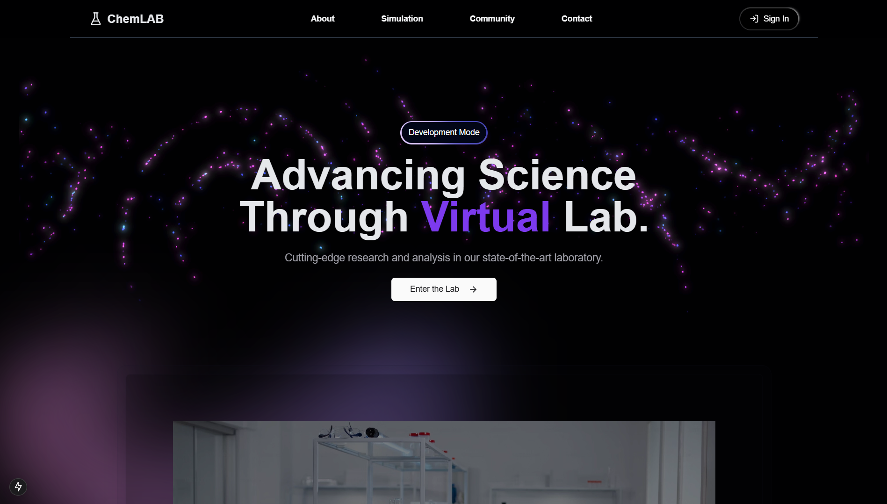
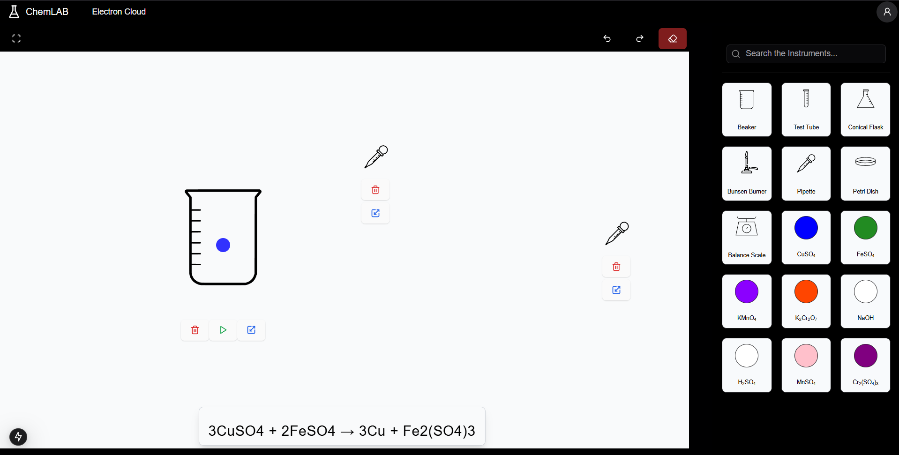

# **2D Chemistry Lab** 🌟  

An interactive web-based chemistry lab where users can drag, drop, and mix virtual chemicals to simulate real-world experiments. Experience chemistry like never before with visually stunning animations, 3D effects, and a user-friendly interface.

---

## **🚀 Features**

- **Drag-and-Drop Experiments**: Intuitive UI for performing virtual experiments.  
- **Interactive Animations**: Realistic molecular motion and reaction effects.  
- **Responsive Design**: Fully optimized for desktop, tablet, and mobile devices.  
- **3D Elements**: Rotating molecular structures using `React-Three-Fiber`.  
- **Modern Styling**: Trendy UI design with glassmorphism and smooth transitions.  
- **Expandability**: Add more chemicals, reactions, and tools easily.

---

## **🔧 Tech Stack**

- **Frontend**:
  - [Next.js](https://nextjs.org/) for server-rendered React apps.
  - [Tailwind CSS](https://tailwindcss.com/) for modern styling.
  - [Framer Motion](https://www.framer.com/motion/) for animations.
  - [React-Three-Fiber](https://docs.pmnd.rs/react-three-fiber/getting-started/introduction) for 3D rendering.
- **Backend**:
  - [Node.js](https://nodejs.org/) with [Express](https://expressjs.com/).
  - RESTful API for managing reactions and user data.
- **Database**:
  - [MongoDB](https://www.mongodb.com/) for storing chemicals, reactions, and user experiments.

---

## **📦 Installation**

Follow these steps to set up the project locally.

### **1. Clone the repository**

```bash
git clone https://github.com/anand-mukul/2D-Chemistry-Lab.git
cd 2D-Chemistry-Lab
```

### **2. Install dependencies**

```bash
npm install
```

### **3. Run the development server**

```bash
npm run dev
```

Visit [http://localhost:3000](http://localhost:3000) in your browser.

---

## **🧪 Usage**

1. Launch the app and navigate to the homepage.  
2. Enter the virtual lab by clicking "Enter the Lab."  
3. Drag and drop chemicals, mix them, and observe reactions.  
4. Enjoy interactive animations and experiment with different combinations!  

---

## **🌈 Screenshots**

### Homepage



### Lab Interface



---

## **📚 Roadmap**

- [ ] Add more chemicals and reactions.
- [ ] Enable user accounts and save experiment history.
- [ ] Introduce collaborative lab sessions.
- [ ] Implement a tutorial mode for students.
- [ ] Optimize 3D rendering performance.

---

## **🤝 Contributing**

Contributions are welcome! To get started:

1. Fork the repository.
2. Create a new branch: `git checkout -b feature/your-feature`.
3. Commit your changes: `git commit -m "Add your feature"`.
4. Push to the branch: `git push origin feature/your-feature`.
5. Open a pull request.

---

## **💡 License**

This project is licensed under the [MIT License](LICENSE).

---
